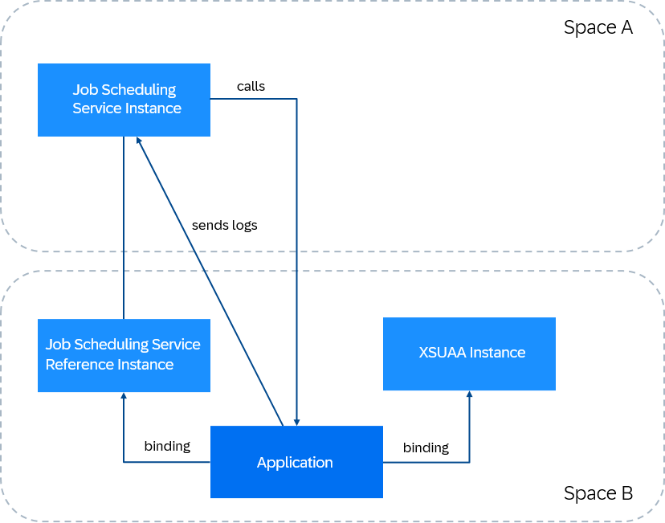

<!-- loioca93a0bd04674c48ab9aee6d7440bdb4 -->

# Share Service Instances

You can share a SAP Job Scheduling service instance with applications across multiple spaces within the same subaccount. This approach streamlines data exchange, reduces costs, and simplifies resource management.


## Prerequisites

-   You must have the *Subaccount Service Administrator* role collection in the specified subaccount. For more information, see [Assigning Role Collections to Users or User Groups](https://help.sap.com/docs/btp/sap-business-technology-platform/assigning-role-collections-to-users-or-user-groups).

-   You can only share instances that are in the same subaccount.


## Context

Sharing service instances in SAP Job Scheduling service involves using SAP Service Manager. To learn more about this feature, see [Sharing Instances](https://help.sap.com/docs/service-manager/sap-service-manager/instance-sharing).

You need to complete two additional important steps. First, after you bind your application to the reference service instance, bind it to an XSUAA service instance as well. Then, update the XSUAA service instance with details about the reference instance.

Here's an overview of an example scenario where a service instance from one space is shared with an application from another space in the same subaccount:




## Procedure

1.  To share a SAP Job Scheduling service with one of your applications, follow the steps in [Sharing Instances Using Various SAP BTP Tools](https://help.sap.com/docs/service-manager/sap-service-manager/instance-sharing-by-service-manager-clients).

    From the available tools, choose either SAP BTP Command Line Interface \(btp CLI\), SAP BTP cockpit, or Service Manager API.

2.  Create an XSUAA service instance and bind your application to it.

3.  Update the XSUAA service instance with the following values:

    ```
    {
        "xsappname": "app-xsappname",
        "scopes": [
            {
                "name": "$XSAPPNAME.jobs",
                "description": "Job Scheduler Scope",
                "grant-as-authority-to-apps": [
                    "<xsappname>"
                ]
            }
        ],
        "oauth2-configuration": {
            "credential-types": [
                "binding-secret",
                "x509"
            ]
        }
    }
    ```

    You can get the value of the property `grant-as-authority-to-apps` from the binding between the reference instance and the application created in step 1:

    ```
    "uaa": {
        "xsappname": "<xsappname>"
    }
    ```


## Results

You can now create jobs that call application endpoints from another space. The application sends logs to the SAP Job Scheduling service instance. To access the SAP Job Scheduling service dashboard and check the logs, go to the space where you created the original service instance. In the example graphic, this is *Space A*.

